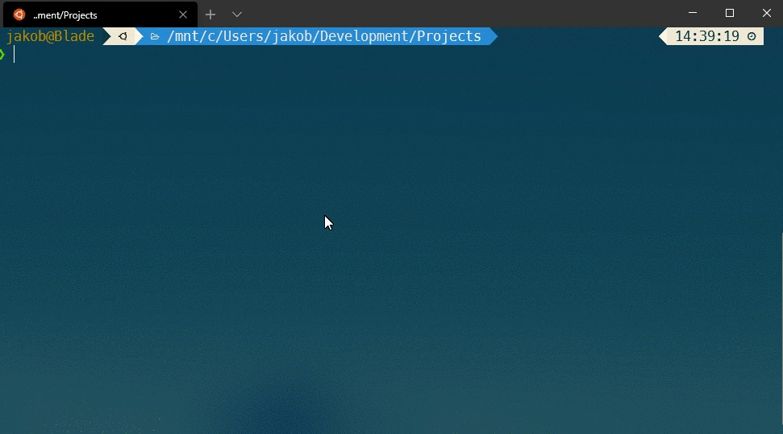
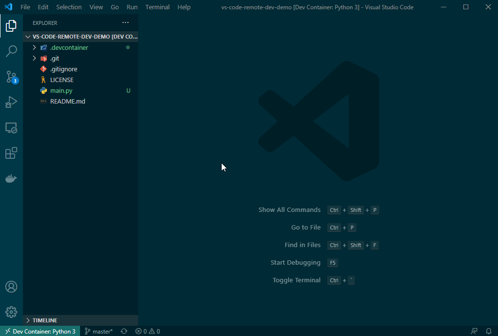
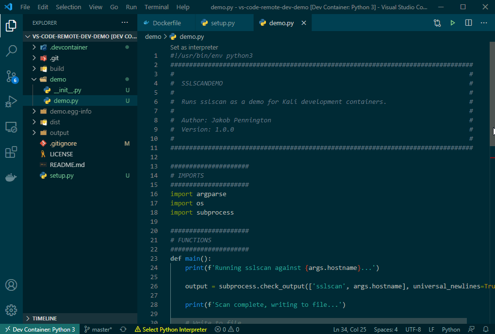

Something that I have struggled with in the past as a software developer turned penetration tester is the fact that I use two operating systems on a daily basis, and this sometimes causes friction in my workflow.

> **Note:** I really don’t intend or want this to be a discussion of the merits of one OS or IDE compared with another. I use the tools that I am familiar and productive with, and it’s totally cool if you use something different. This is just me trying to optimise the tools that I like to use, and sharing it with others who might find it useful.

See, for day-to-day tasks such as gaming and web browsing, I use Windows as my primary OS. I also happen to use Windows for my work as a software developer, and I have worked over the years to improve the tooling and workflow I follow to increase my effectiveness when writing code in Windows.

However, as a penetration tester and bug bounty hunter, I get a lot of value out of the tooling that comes with a Linux distribution like Kali. I am much more comfortable in the Linux terminal than I am with Command Prompt or Powershell, and there are a ton of great tools that are built for Linux specifically.

So, almost out of necessity, I use two OSes to do my work. I have two horses to run the specific courses I race on, and this typically works pretty well for me.

The issue arises when worlds collide, and I want to write _code_ to help with penetration testing or bug bounty hunting. I often write scripts that rely on tooling available on Linux, but that means I need to write those scripts within a VM or using a terminal text editor rather than my favourite IDE.

## Introducing Remote Development for VS Code

My IDE of choice for most programming and scripting languages is Visual Studio Code. Last year, VS Code introduced a new feature called [Remote Development](https://code.visualstudio.com/docs/remote/remote-overview) which completely changed how I write my tooling.

Remote Development lets you write code in VS Code on your computer, as you normally would, while connected to a remote development environment such as a Docker container, WSL, a remote machine via SSH.

This feature supports a number of interesting workflows such as running your development environment in the cloud while you code from your laptop, but the way I use it is to use a Docker container as my development environment.

**Here’s how it works:**

*   I set up my code repository as I normally would and open the repository with VS Code. All the development is done the same was as if I was locally building a web application.
*   I configure VS Code to use a Docker container for my development environment. So that I have access to all the tools I would use during a penetration test such as `nmap`, `nikto` and `sslscan`, I can use the official [Kali docker container](https://www.kali.org/news/official-kali-linux-docker-images/).
*   VS Code launches the Kali container with my scripts inside so I can code and test my scripts in a Kali environment, all while working from my Windows environment.

**Interested? Here’s how:**

1.  If you haven’t already, you’ll need to install [Docker for Windows](https://docs.docker.com/docker-for-windows/install/) so your Windows machine can run Docker containers.
2.  Follow the [VS Code documentation](https://code.visualstudio.com/docs/remote/containers) to install Remote Development and grant Docker access to the directories where you store your scripts and source code.
3.  Create or clone your code repository within the directory that you granted Docker access, and open the folder in VS Code.

4.  In the bottom left, you will see the Remote Desktop icon (Looks like ><). Click this, select ‘Reopen in container’ and choose a base container to use. I chose the Python 3 container, but you can pick any. We’ll be overriding these settings shortly.

You’ll notice in the GIF below that once the container runs, we can open a shell within that container. Cool, huh!

5.  You will notice that the first time you run in a dev container, VS Code creates a new folder called `.devcontainer` which contains all the configuration we need, including a config file and a Dockerfile.

Let’s override the Dockerfile with one that uses the Kali as the base image. Replace the Dockerfile with one that uses Kali (you can find a demo Dockerfile [here](https://github.com/JakobTheDev/vs-code-remote-dev-demo/blob/master/.devcontainer/Dockerfile)) and tell VS Code to rebuild the container.

6.  Now that we’re running in Kali, let’s write a script that uses a Kali tool. Our demo is a simple script that runs `sslscan` against a host and saves the output to file.

Using VS Code and Remote Development, we have created a seamless workflow to write tooling that is designed to be run in our Kali penetration testing environment, all from a Windows host.

## Try it yourself

If you would like to try this out yourself or copy the demo config as a starting point, you can find the source code on GitHub.

[https://github.com/JakobTheDev/vs-code-remote-dev-demo](https://github.com/JakobTheDev/vs-code-remote-dev-demo)

## Bonus round

As I have [written about in the past](../docker-for-pentesters), I have migrated to using Docker containers as the basis for my penetration testing and bug bounty hunting environments. The way I use Remote Development to build my tooling is:

1.  Create Docker images that I use for penetration testing and bug bounty hunting, including all the tools and configuration that allows me to do my work effectively.
2.  Configure VS Code to use _that_ Docker image as the basis for Remote Development.

This workflow means that my scripts and my environment are all built and refined in parallel, preventing issues with a script I write over _here_ not working during a test when I use it over _there_.

The best part is, I can do it all from Windows, where I can most productively write code 😄

---

**Thanks for reading!**  
If you enjoyed this post, follow on [Twitter](https://www.twitter.com/@JakobTheDev) or [Mastodon](https://infosec.exchange/@JakobTheDev) for more content. If you have any feedback or suggestions, leave it in the comments below and I'll do my best to get back to you.
