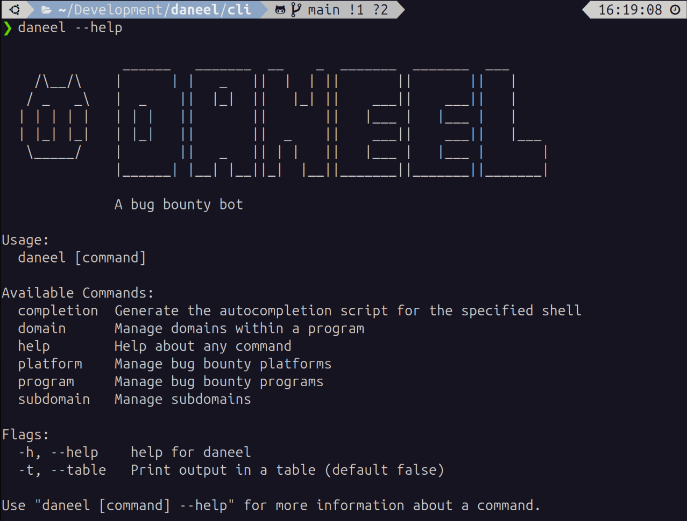

G'day!

I'm Jakob, an Application Security consultant from Australia, and this is my blog on bug bounty hunting. After a long hiatus from bug bounty, I have decided to fire up nikto again and start scanning the web for fun and profit. This blog is all about committing what I'm learning and thinking to paper, and to share it with the world.

You can check out previous posts here:
- [BBB #1: Back Hunting](https://jakobthe.dev/posts/bbb-1-back-hunting/).

---

## Daneel - A bug bounty bot

This week, I began building my own bug bounty automation tool: `daneel`

*The initial set of commands available in the daneel CLI*

The tool is called `daneel` because, like Elijah Baley's robot sidekick in Isaac Asimov's Robot series, `daneel` will be my detective partner in my bug bounty adventures. I can't promise a positronic brain, but I hope to build enough smarts into `daneel` to at least follow the first law of robotics and do no harm.

Reflecting on my [motivations for returning bug bounty hunting](https://jakobthe.dev/posts/bbb-1-back-hunting/#why-am-i-starting-again), I have decided to build this tool totally in the open. This way, others can follow how I'm approaching building `daneel`, while also opening up opportunities for feedback and collaboration.

You can find the  repo on GitHub: https://github.com/JakobTheDev/daneel

### Why am I building bug bounty automation?

This is a reasonable question. Why do we see so many hunters writing custom automation for bug bounty hunting, and why am I building automation as one of my first priorities as I return to bug bounty hunting?

There are a myriad of ways that automation can help us find bugs. Automation can help us:

- **Perform preliminary scanning enumeration faster and with less effort**  
  Over time, hunters build an approach to starting on a new program or a new application. The more we can automate these process, the quicker and easier we can get our bearings and start manual testing.
- **Find software that hasn't been tested by other security researchers**  
  You can guarantee that the primary website or app for a given program has received a lot of attention from other hunters. While it is [absolutely worthwhile](https://youtu.be/FqnSAa2KmBI?si=89gt7QSRaJNIBJPJ&t=326) testing these applications ourselves, we may have better luck finding bugs in software that has received less attention. Automation can help us find hosts, ports, services, pages, APIs and parameters that are off the beaten track, and have received little attention from other security researchers.
- **Monitor a program's scope for changes over time**  
  A bug bounty scope is not a static target. If we can be the first to find a new app, feature, API or any other change in our target scope, we can be the first to test for new bugs.
- **Learn programming**  
  Building automation is a great motivator to learn programming. Whether you are a seasoned programmer who wants to pick up a new language or framework, or a complete newbie looking for an excuse to learn how to code, we can all learn by building something ourselves. In my case, I've been wanting to learn golang for a while now, and now I have an excuse!
- **Have fun (It's so, so satisfying)**  
  Let's be real, part of the reason we build automation is the act of building itself is satisfying. Planning, building, evolving and refining our toolkit is so much fun, and is a great low-stakes place to tinker and build something new. 

### What can daneel do?

At the moment, not a great deal... I have spent the week scaffolding the project and building the basics of bug bounty program management into `daneel`. 

Currently, `daneel` can:

- Track bug bounty platforms (e.g., Bugcrowd)
- Track programs within a platform (e.g., Canva)
- Track domains within a program (e.g., canva.com, lifeatcanva.com)
- Track subdomains within a domain (e.g., www.canva.com)
- Store all of this data in a SQL database for persistence

Now that I have basic CRUD operations on the key entities we'll be tracking, I can start building out subdomain enumeration, port scanning and content discovery. More on this in next week's post.

### What's the tech stack?

Since one of my goals is to learn golang, I'll be writing as much of `daneel` in go as I can. These are the key technologies I'm using in `daneel`:

- **[go](https://go.dev/)** - The programming language.
- **[cobra](https://github.com/spf13/cobra)** - A go package for writing CLI apps (used to build the Hugo and GitHub CLIs)
- **[SQL Server]()** - Some habits die hard. I'll be using SQL Server for my database, with the database schema defined within a SQL Server Database Project so that I can easily publish schema changes. 

> **Note:** I'm totally new to golang. If you're a go programmer and you have feedback on how I'm writing code, structuring my project or have any other tips, please let me know! I'm here to learn and I'm open to feedback and collaboration. 

### What's the plan for daneel?

Initially, `daneel` will be purely a CLI tool that supports basic bug bounty scanning and enumeration. My goal is to build MVP tool that prioritises extensibility, so that I can easily add new features over time. I also want to get to MVP as soon as possible, so that I can turn my attention to hunting for bugs.

Initially, `daneel` will be:
- A CLI tool
- Able to manage bug bounty platforms and programs
- Able to manually add domains to a program's scope
- Able to manually add subdomains to a domain
- Able to scan a domain for subdomains

This level of automation will give me enough information to be able to find and select targets for deeper inspection. A good place to start.

Over time, I would like to extend `daneel` to:
- Track bug submissions
- Filter out inactive subdomains
- Scan for open ports and services
- Perform content discovery on active web servers
- Take screenshots of active web services
- Track differences between successive scans
- Run in the cloud, allowing for scheduled scanning
- Send notifications when anything interesting is found

Ultimately, I would love to get to a position where `daneel`:
- **Has a web interface** - A web UI would allow for graphical presentation of data stored within `daneel` and may make it a little easier to use than a CLI.
- **Includes custom tooling** - It's one thing to string together a set of existing tools, but it's another thing to build out custom tooling to perform testing that other security researchers aren't performing.
- **Becomes a collaborative project** - One of my goals is to meet and collaborate with other hunters. I'd love to get to a point where I'm working with other security researchers on `daneel`. If you're interested, reach out! 

Building `daneel` has been a lot of fun so far, and I'm looking forward to building it out over time and seeing where it goes.

---

## Weekly stand-up

Each week, I take a look back at the week that was, and plan ahead for the coming week.
### What I planned to achieve this week

- [x] **Set a schedule**  
    I have negotiated a half-day per week off of work for bug bounty, and have blocked out some time on the weekend and evenings to dedicate to hunting. My initial schedule is:  
    - Sun 3pm-7pm (dedicated to writing this blog)  
    - Tue 8:30am - 12:30pm  
    - Tue 7pm - 9:30pm  
    - Thu 7pm - 9:30pm  
    This gives me around 13 hours per week dedicated hunting and writing. I may be able to squeeze in some extra hours here and there for reading and learning. 
- [x] **Reactive accounts**  
    This took _way_ longer than I expected, since I had to set up and recover MFA for most of my accounts. Thankfully, most of my accounts had MFA recovery codes in my password manager.
- [x] **Set up my hacking environment**  
    This task started with setting up Burp Suite and pulling my old Docker images and turned into... setting up a new Linux partition and migrating from Windows to Linux for my daily driver. This has been a lot of fun, and I have more to say on the topic, but not just yet.
- [ ] **Go over old notes**  
    I've had a change of heart and decided to do a green-fields reboot of my bug bounty tooling and methodology. I still have all my old notes to refer back to when needed, but for the most part I'm happy start from scratch, unburdened by my previous choices of technology and approach. 
- [x] **Begin researching latest tooling and techniques**  
    I love systems, so I have set up a system for learning about bug bounty hunting and application security. I may have more to say on this topic in future, but for now all I will say is I have a 
- [x] **Begin planning automation**  
    I may have been a little conservative on this part of the plan. More than just planning automation, I've started to build partner `daneel`. 

### Plan for the coming week

Here's how I plan to tackle the coming week:

1. **Complete Daneel MVP**
   As I said in my first blog post, time spent on building automation is time not spent hunting. While there is certainly value to investing in automation, I don't want it to turn into a vehicle for procrastination on what I'm actually here to do - improve my offensive security skills and hunt for bugs.  
   My aim is to time-box my initial "MVP" build of `daneel` to the end of this week, including:
   - Platform management
   - Program management
   - Domain management
   - Subdomain management and basic enumeration
   - Service management and basic enumeration
   - Basic content discovery  
2. **Select my first program**  
   With the `daneel` MVP ready to go, all that's left is to start bug bounty hunting. The first step will be to select a program to work on. This week I'll review the programs available on Bugcrowd and pick one to start hacking on.

I've got a lot to do, better get back to it!

\- Jakob