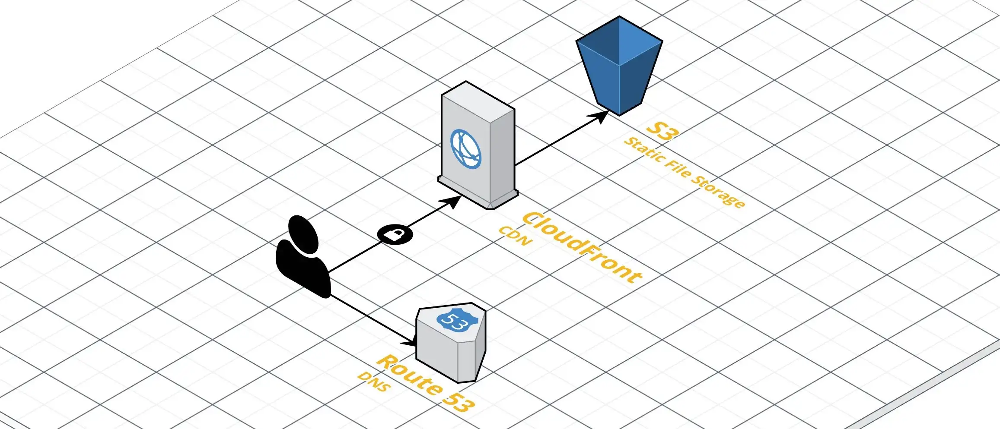

Recently, I made a simple personal website — a hub for my online presences and a place to share my personal projects. I developed the site using the Angular CLI, and when it came time to host the site, I chose AWS since my domain was already set up in Route 53. Overall, the process of building the application and hosting it on AWS was a fairly simple one (you could probably set the whole thing up in about an hour), but there were a couple of gotchyas that prompted me to write down the process. So I figured, why not save somebody the hassle of working out the nitty gritties! Here’s my step-by-step guide to setting up a SPA in AWS.

* **Time:** 1hr
* **Upfront cost:** $0
* **Ongoing cost:** Very little, depends on how popular your site is!

## What do we want to achieve?

The simplest way to host your site is to upload your code to an S3 bucket and share the default URL. This might save you a few minutes in hosting the site, but it’s not ideal… The URL will look something like `http://jakob.pennington.io.s3-website-ap-southeast-2.amazonaws.com` (Good luck getting Grandma to type that in). Also, the site will only be available over an insecure HTTP connection. Sensitive information or not, every website you ever make should be hosted exclusively over HTTPS. Spend 5 minutes on [@TroyHunt](https://twitter.com/troyhunt)'s Twitter to learn all the reasons why. Finally, if somebody clicks a link like `http://jakob.pennington.io/duckies`, or even refreshes the page, they won't be greeted with adorable fluffy waterfowl, but rather an error page. This is because, in a SPA, the application handles routing, and S3 is a little dumb and will try to find a file called 'duckies'.

So in addition to hosting the site, we want to:

* Set up our own domain name,
* Set up SSL, and redirect all HTTP traffic to HTTPS, and
* Hand all requests to the root of the site, so Angular can handle routing.

To do this, we’re going to use the following AWS services:

* **S3** — Since our application is static, we can host the files in an S3 bucket.
* **Certificate Manager** — Get a free SSL Certificate for HTTPS.
* **CloudFront** — Primarily to provide HTTPS, we’ll set up a CloudFront distribution for our site.
* **Route 53** — Finally, we’ll set up Route 53 to point to our CloudFront distribution.

All in all, we’ll end up with something like this:


*The AWS architecture we'll be using.*

## Build the site
This part is really dependent on how you’ve created your site. Since I build my web application with the Angular CLI, building the production site was easy:

```bash
ng build --prod
```

If you built your site with something else, that’s cool too! I’ll leave it to you to build the production codebase, since out of you and I, you’re probably the expert there 😉

## Set up a domain in Route 53

1. **Register a domain**  
  Go get yourself a domain, if you haven’t already. Check out [Hover](https://www.hover.com/) or [GoDaddy](https://au.godaddy.com/) or if you’re feeling adventurous, grab yourself an emoji domain from [i❤️.ws](https://xn--i-7iq.ws/).

2. **Create a Hosted Zone in AWS**  
  Log into the [AWS Console](https://console.aws.amazon.com/) and head to the Route 53 page. Create a new hosted zone, enter your domain (eg. _pennington.io_) and leave the type as Public Hosted Zone.

3. **Change registrar DNS**  
  We want to let Route 53 handle DNS. In your domain management page on your registrar’s website, set the DNS servers to the values in the NS record in the Hosted Zone you created in Route 53.

We’ll come back at the end to set up the records to point at your site.

## Host the site in S3

1. **Create a bucket**  
  In the AWS Console, head to the S3 page and create a new bucket. Be sure to give the bucket the same name as the FQDN of where the site will be hosted. For me, I created a bucket called `jakob.pennington.io`. When you get to the _Set Permissions_ step, set _Manage public permissions_ to _Grant public read access to this bucket_.

2. **Upload files**  
  Once the bucket has been created, open up the bucket and copy in the built website. Make sure you copy everything, including your index.html, favicon, JS, CSS and any images.

3. **Turn on static website hosting**  
  Head to the properties tab and select static website hosting. Set both the index and error documents to index.html to tell S3 where the root of the web application lies. This won’t matter so much once CloudFront is set up, but we might as well set them while we’re here.
4. **Configure the bucket policy**  
  Head to the Permissions tab, then Bucket Policy, and copy in the following policy. This policy allows the public to read objects from the bucket (So don’t put any secrets or sensitive information in here). Be sure to replace the Resource ARN to your own, it should be displayed on the Bucket Policy page.

```json
{ "Version": "2012-10-17", "Statement": [ { "Sid": "PublicReadGetObject", "Effect": "Allow", "Principal": "*", "Action": "s3:GetObject", "Resource": "arn:aws:s3:::jakob.pennington.io/*" } ] }
```

At this point, you should be able to access your site. Go back to Properties > Static website hosting to get the URL of your website.

## Get an SSL Certificate

Next, we need to generate a certificate using AWS Certificate Manager. Head to ACM in the console and provision a new public certificate. Set the domain name to either the FQDN (jakob.pennington.io) or create a wildcard certificate (*.pennington.io). Select _DNS Validation_ and confirm the request. In the final step, expand the domain you created and click _Create record in Route 53_. This creates a record in Route 53 to verify that you own the domain, which can take up to 30 minutes.

## Set up CloudFront distribution

Next, we’ll set up CloudFront as a CDN for our site. This will let us configure HTTPS while improving the performance of our site as a bonus!

1. **Create the distribution**  
  Go to CloudFront in the AWS Console and create a new web distribution. This is the most config-heavy part of the process, so set the following values and leave the rest as defaults:
    * **Origin Domain Name:** Select your S3 bucket from the drop-down list.  
    * **Viewer Protocol Policy:** Redirect HTTP to HTTPS  
    * **SSL Certificate:** Custom SSL Certificate. Here, select the certificate you created with ACM.  
    * **Security Policy:** Select TLSv1.1_2016 or TLSv1.2_2018.  
    * **Default Root Object:** index.html

2. **Set up redirects to index.html**  
  Once the distribution is created, open the distribution and head to the Error Pages tab. Here set up two custom error responses — one for 403 Forbidden and one for 404 Not Found.
    * **HTTP Error Code:** 403 / 404  
    * **Error Caching Minimum TTL (seconds):** 0  
    * **Customize Error Response:** Yes  
    * **Response Page Path:** /index.html  
    * **HTTP Response Code:** 200: OK  

What this does is redirects all error responses to index.html, effectively letting the SPA handle routing.

## Set up a DNS record

The last step is to set up a DNS record in Route 53 to point at the CloudFront distribution. To do this, we will create an A Record, which is a type of DNS record that lets the browser resolve a domain name (jakob.pennington.io) to an IP address (123.123.123.123). Head to Route 53, select your Hosted Zone, and create a new Record Set with the following settings:

* **Name:** The subdomain you want to use (eg. www, the part before your domain name). This needs to match the subdomain you set in S3, CloudFront and Certificate Manager)  
* **Type:** A — IPv4 address  
* **Alias:** Yes  
* **Alias Target:** Select your CloudFront distribution from the drop-down list.  

That’s it! if you navigate to your chosen URL you should see your site. Check that HTTPS is set up and HTTP redirects to HTTPS. While you’re at it, go check out mine too! I’ll be adding new content over the coming weeks and months.

https://jakob.pennington.io/

If you have any comments on my site or something you’d like to see in a future post, leave them below 😊

## A note on CloudFront caching

One final bit. CloudFront, as a CDN, stores copies of your website all over the world to make your site faster to access. The problem is, if you make a change to your site, it can take some time for the changes to propagate. You can force this to happen faster by invalidating the files in the distribution:

1. Go to CloudFront and select your distribution.  
2. Head to the Invalidations tab.  
3. Create an Invalidation, and set the Object Path to: /*  

---

**Thanks for reading!**  
If you enjoyed this post, follow on [Twitter](https://www.twitter.com/@JakobTheDev) or [Mastodon](https://infosec.exchange/@JakobTheDev) for more content. If you have any feedback or suggestions, leave it in the comments below and I'll do my best to get back to you.
