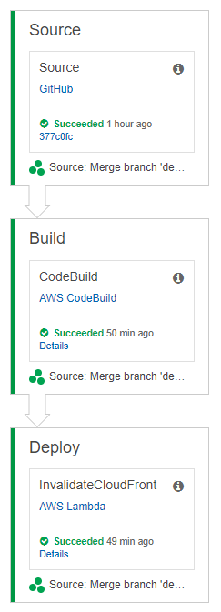
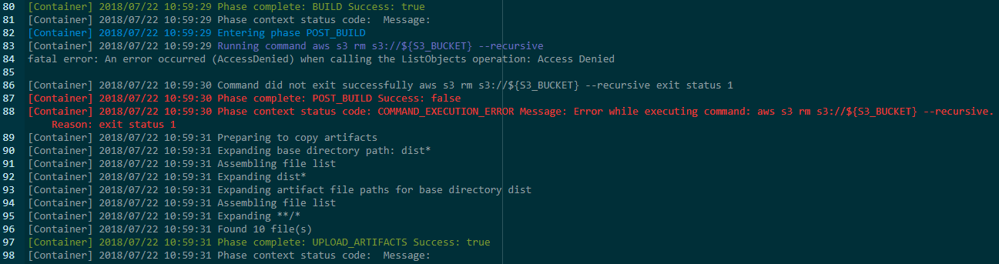

In my last post, I showed how you can [deploy a Single Page Application to AWS](../deploy-spa-aws) using AWS’ S3, CloudFront and Route 53. This post picks up where the last one left off, so if you haven’t read it, go check it out!

This time, we’ll be improving our DevOps by building a basic CI/CD pipeline. Since we’re already using AWS to host our site, it makes sense to keep using their services since they do integrate well together (That’s how they get you!). But in all honesty, while they can be tricky to configure, AWS’ services are quite powerful, customisable to the Nth degree, and are largely free until you begin to scale.

## What do we want to achieve?

For this project, I am a lone developer, so I have adopted a simple git branching policy — one branch for development and one for production. Once I have finished building a feature in the development branch, I merge the code into the production branch for deployment. On this merge, I want to trigger a build and deploy of the codebase to the production website.

This deployment pipeline will look like this:

1. Clone the production branch to the staging environment.
2. Install all of the necessary `npm` packages.
3. Do a production build with the Angular CLI.
4. Replace the files in the site’s S3 bucket with the new build.
5. Trigger an invalidation of the files cached by CloudFront.

To do this, we’ll be using the following services:

* **GitHub** — This will be our source code repository. We’ll need to set up a Git Hook to trigger a build on merge into the production branch.
* **CodePipeline** — CodePipeline will orchestrate the build process.
* **CodeBuild** — CodeBuild will do the heavy lifting to build the code and deploy it to S3.
* **Lambda** — We’ll set up a Lambda function to invalidate files cached by CloudFront to get the new site to the people ASAP.
* **IAM** — Finally, we’ll need to set up some roles with permissions to do all of the above.

With this basic pipeline set up, we can build out a more complex pipeline with build success / fail notifications, unit and end-to-end testing and more. (Stay tuned for future blog posts 😉)

## Set up a build specification

First off, we’ll set up the build process with CodeBuild. CodeBuild uses a build specification file to define which commands need to be run in order to build the project. This makes the build process highly configurable and source controlled, meaning the build definition lives and evolves with your project, making it easier to roll back to earlier builds or migrate from CodeBuild to another build tool.

In the root directory of your codebase, create a file called buildspec.yml and add the following code.

```yaml
version: 0.1
environment_variables:
    plaintext:
        S3_BUCKET: "jakob.pennington.io"
phases:
    install:
        commands:
            - echo Installing source NPM dependencies...
            - npm install
            - npm install -g @angular/cli
    build:
        commands:
            - echo Build started on `date`
            - ng build --prod
    post_build:
         commands:
            - aws s3 rm s3://${S3_BUCKET} --recursive
            - aws s3 cp dist/PenningtonIO/ s3://${S3_BUCKET} --recursive
            - echo Build completed on `date`
artifacts:
    files:
        - '**/*'
    base-directory: 'dist*'
    discard-paths: yes
```

> **Warning:** You can configure this as you wish, but don’t change the version number. This is not the version number of this particular build, but the version of Build Spec itself.

You can tailor the commands for each phase as you wish, just don’t forget to update the value for `S3_BUCKET` at the beginning of the script, and replace `dist/PenningtonIO/` with the path to the directory containing the built project relative to buildspec.yml. (This is usually just `dist/`)

## Configure the build with CodePipeline and CodeBuild
Next, fire up the AWS Console and head to CodePipeline. Create a new pipeline and give it a name. In the next step, select GitHub as the source provider and click _Connect to GitHub_. Authenticate to GitHub and grant AWS permissions to set up the Git Hook to trigger the build on merge into master. Select your repository and the production branch and hit next.

In Step 3 you will configure CodeBuild to build the application based on the Build Spec. Select AWS CodeBuild as the build provider, create a new build configuration and give it a name and description. Leave the majority of the settings as default, and set the following:

* **Operating System:** Ubuntu
* **Runtime:** Node.js
* **Version:** Whichever matches your local environment.

Create a new service role, give it a name, and AWS will automatically configure it with _most_ of the permissions it needs. Save the build project and hit next.

Since we’re copying the build code to S3 in our Build Spec, we can choose _No Deployment_ as our deployment provider. In the next step, provide a name for the role and create the role with the default permissions. Review the details of the pipeline and when you’re sure you’ve set everything, hit create.

## Add permissions to CodeBuild service role

The service role that was created for the CodeBuild project has most of the necessary permissions; however, we’ll need to add permissions to allow access to the S3 bucket hosting the production codebase. Head to IAM and edit the CodeBuild service role. Attach a new policy with the following configuration. (Don’t forget to update both resources to your S3 bucket’s ARN)

```json
{
    "Version": "2012-10-17",
    "Statement": [
        {
            "Sid": "VisualEditor0",
            "Effect": "Allow",
            "Action": [
                "s3:PutObject",
                "s3:ListBucket",
                "s3:DeleteObject"
            ],
            "Resource": [
                "arn:aws:s3:::jakob.pennington.io/*",
                "arn:aws:s3:::jakob.pennington.io"
            ]
        }
    ]
}
```

Next, we’ll create a Lambda function that triggers an invalidation of cached files in CloudFront, allowing users to see the updated website immediately after it’s deployed. Go to the Lambda page in the AWS Console and create a new function. Give the function a name, select Python 2.7 as the runtime, and create a new role for the function with the following permissions.

```json
{
    "Version": "2012-10-17",
    "Statement": [
        {
            "Action": [
                "logs:*"
            ],
            "Effect": "Allow",
            "Resource": "arn:aws:logs:*:*:*"
        },
        {
            "Action": [
                "codepipeline:AcknowledgeJob",
                "codepipeline:GetJobDetails",
                "codepipeline:PollForJobs",
                "codepipeline:PutJobFailureResult",
                "codepipeline:PutJobSuccessResult"
            ],
            "Effect": "Allow",
            "Resource": "*"
        },
        {
            "Action": [
                "cloudfront:CreateInvalidation",
                "cloudfront:GetDistribution"
            ],
            "Effect": "Allow",
            "Resource": "*"
        }
    ]
}
```

Copy the following python code into the function and replace `DISTRIBUTION_ID` with the ID of the distribution that hosts your website.

```python
import boto3
import time
def lambda_handler(event, context):
    allFiles = ['/*']
    client = boto3.client('cloudfront')
    invalidation = client.create_invalidation(
        DistributionId='DISTRIBUTION_ID',
        InvalidationBatch={
            'Paths': {
                'Quantity': 1,
                'Items': allFiles
        },
        'CallerReference': str(time.time())
    })
    
    pipeline = boto3.client('codepipeline')
    response = pipeline.put_job_success_result(
        jobId=event['CodePipeline.job']['id']
    )
    return response
```

## Add the Lambda function to the pipeline

Finally, we’ll need to tell the pipeline to trigger the Lambda function after the build stage has completed. Head back to CodePipeline and edit the pipeline you created earlier. Add a new stage after Build, call it Deploy. Create a new action with the Action Category `Invoke`, give it a name and select AWS Lambda as the provider. Select the Lambda function you created earlier and add the action. Finally, save the pipeline changes.


## Take it for a spin
That’s it, all set to go. For an end-to-end test, merge some code changes into your `master` branch and push the changes to GitHub. The build time will depend on the size and complexity of your application, but a simple application takes about 10 minutes to deploy on the lowest tier build environment.



From the CodePipeLine screen, you can see how the release is progressing and identify any issues. CodeBuild provides a full output of all logs captured during the process, so you can use these to troubleshoot any issues with the codebase or AWS configuration.



---

**Thanks for reading!**  
If you enjoyed this post, follow on [Twitter](https://www.twitter.com/@JakobTheDev) or [Mastodon](https://infosec.exchange/@JakobTheDev) for more content. If you have any feedback or suggestions, leave it in the comments below and I'll do my best to get back to you.
