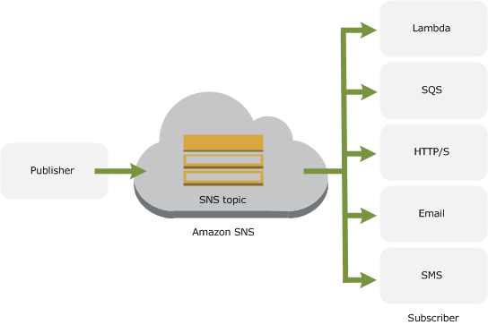
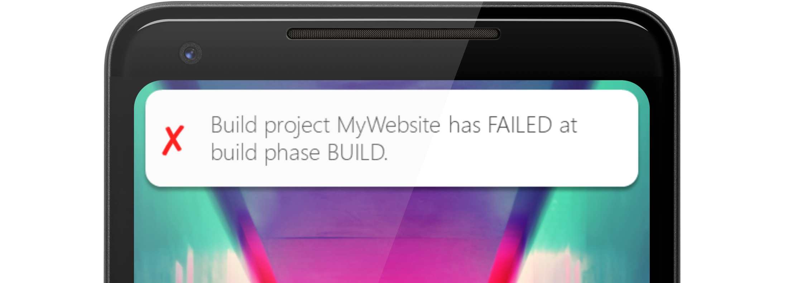
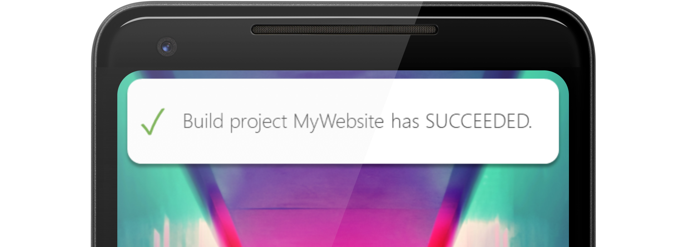

This post is Part 3 in a 🤷-Part series on CI/CD in AWS. Go check out my other posts to see how we got here:  
[Part 1: Deploy a Single-Page Application (SPA) to AWS](../deploy-spa-aws)  
[Part 2: Automated Build / Deploy with AWS CodePipeline](../aws-codepipeline)

In the last post, we set up a simple CI/CD pipeline that deploys our codebase into production each time new code is merged into the production codebase. This is great, but once we kick off a build we have two options:

1.  Say YOLO, grab a coffee and hope like heck it worked, or
2.  Sit there nervously watching the AWS Console to see if the build succeeds or fails.

Neither of these options is ideal. The whole idea of DevOps is the ability to release builds as often as we like in a secure, repeatable way with the confidence that each line of code has passed a series of checks and balances before it makes it into the production environment. To do this, we’ll want some visibility of what happens after we send our commits off into the void.

This time, we’ll set up some basic notifications that tell us if a deploy has been successful, or if it fails, where it has failed so we can follow it up. We’re going to set up SMS notifications because it’s the simplest way to get notifications on your phone, but we could just as easily set up emails, notifications on Slack or something similar.

### What are we working with?

The setup is pretty straightforward. Natively, events in AWS’ various services are logged in CloudWatch, including the success and failure of builds in CodeBuild. We’ll set up some rules that listen for specific events in CodeBuild, create notification payloads based on the success or failure of the event, and hand the payload to Simple Notification Service (SNS) which will send the notification via SMS.

### Set up SNS

AWS SNS works on the concepts of publishers, topics and subscriptions which allow notifications to be sent based on events in other AWS services.

*   **Publisher** — Publishers send messages to SNS Topics when particular events are triggered. In our case, the publisher is CloudWatch and the message will be our SMS payload.
*   **Topic** — Topics act as intermediaries between publishers and subscribers, allowing access controls to be enforced and allowing multiple subscribers to subscribe to a publisher’s messages. For example, we could send SMS messages and email notifications using multiple subscribers to a single topic.
*   **Subscriber** — Subscribers are the message delivery media used for notifications e.g. SMS, email and web requests.




### Create a Topic

SNS Topics are one of the simplest things you’ll create in AWS. Head to the SNS section of the AWS Console and click _create new topic._ Give the topic a name and a description and click _create a topic._ Done! Once the topic has been created, copy the ARN which will look something like `arn:aws:sns:REGION:ACCOUNT_ID:TOPIC_NAME`.

Still, in the SNS section, create a new subscription and paste the ARN into the ARN field. Next, choose the type of notification you want to send, and provide a target for the notification. In our case, we’ll choose SMS and enter the mobile number to receive the message, including the international prefix (+61 for you fellow Australians 🇦🇺).

### Create rules in CloudWatch

Next, we’re going to set up two rules in CloudWatch which will listen for specific events in CodeBuild, construct a notification payload, and publish the notification to our SNS topic. The reason for the two rules is simple: if the build succeeds, we want to know. If the build fails, on the other hand, we not only want to know that it failed, but which stage of the build failed. Was there an issue in building the source code, or was the issue related to deploying the code to S3? We can get creative with notifications, but this is a good place to start.

Head to CloudWatch and create the first rule. Leaving the event source as event pattern, click _edit_ on the event pattern preview and copy in the following JSON.

```json
{
    "source": [
        "aws.codebuild"
    ],
    "detail-type": [
        "CodeBuild Build Phase Change"
    ],
    "detail": {
        "completed-phase-status": [
            "TIMED_OUT",
            "STOPPED",
            "FAILED",
            "FAULT",
            "CLIENT_ERROR"
        ]
    }
}
```

This will be our failed build notification. The rule listens for phase change events, and if any of the events have one of the failed statuses, the rule will be triggered. In the targets section, add a new target and choose SNS topic. Select the topic you just created in the dropdown and configure the input using an input transformer. This option lets us take elements from the CodeBuild event and use them to construct our notification. In our case, we’ll want to know which build project failed, which phase failed and the status of failure.

Copy the following into the two fields.

```json
{  
  "completed-phase": "$.detail.completed-phase",  
  "project-name": "$.detail.project-name",  
  "completed-phase-status": "$.detail.completed-phase-status"  
}
```
```text
"Build project <project-name> has <completed-phase-status> at build phase <completed-phase>."
```

Click configure details, give the rule a name and description and save the rule.



Next, set up a second rule following the same process, this time copying the following into the relevant fields.

Event pattern:

```json
{  
  "source": [  
    "aws.codebuild"  
  ],  
  "detail-type": [  
    "CodeBuild Build State Change"  
  ],
  "detail": {  
    "build-status": [  
      "SUCCEEDED"  
    ]
  }
}
```

Input Transformer:
```json
{  
  "build-status":"$.detail.build-status",  
  "project-name":"$.detail.project-name"  
}
```

```text
"Build project <project-name> has <build-status>."
```



That’s it! Kick off a build process either by committing some code or triggering a build manually through the console. Feel free to get creative and set up different SNS Subscriptions and CloudWatch Rules to get notified about all sorts of things in AWS.

### Thanks

Hero background photo by [Tim Mossholder](https://unsplash.com/photos/smoHvx4e3TU?utm_source=unsplash&utm_medium=referral&utm_content=creditCopyText) on Unsplash. Phone background photo by [Efe Kurnaz](https://unsplash.com/photos/RnCPiXixooY?utm_source=unsplash&utm_medium=referral&utm_content=creditCopyText) on Unsplash. Device art created with the [Android Device Art Generator](https://developer.android.com/distribute/marketing-tools/device-art-generator).

---

**Thanks for reading!**  
If you enjoyed this post, follow on [Twitter](https://www.twitter.com/@JakobTheDev) or [Mastodon](https://infosec.exchange/@JakobTheDev) for more content. If you have any feedback or suggestions, leave it in the comments below and I'll do my best to get back to you.
