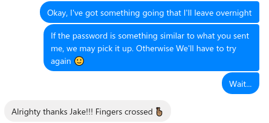
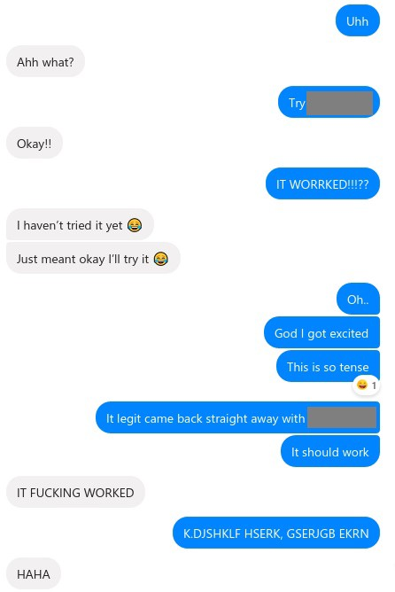

This is a story about my favourite moment in Information Security so far. I thought, rather than just breaking down the technical part, I’d branch out and try something different. If you’re just interested in iOS security, feel free to skip ahead 👌

> **Note:** Unfortunately, for legal reasons, I can’t crack your password for you.

---

If you’ve ever worked in the IT industry, are good with computers, or were simply born after 1980, then you’re probably asked every other week to provide tech support. It may come from your family, it may come from your friends, but inevitably you’ll get a message or a call from somebody in distress whose hard drive has died or Facebook was hacked.

This forces you to do some mental arithmetic on your ethics. You want to help people, but you’re a busy person and these things take time to do. Plus, you know you’ll be doing it for free, and are you really that close with this person? Inevitably, you say yes because of who you are as a person, then spend the next week of your free time cleaning viruses, replacing hard drives, reinstalling Windows and doing whatever else needs to be done.

Recently, I got a message from a good friend of mine:

> Do you have a program that can unlock passwords that I can’t reset? 😥

After some back and forth, I worked out that my friend (let’s call her Jesse) had bought a new iPhone and wanted to restore the backup from her old phone. The problem was that the backup was encrypted and, of course, she couldn’t remember the password. It was one of those cases where the thing that’s designed to keep the bad guys out was doing a pretty good job at keeping her out too. A safe doesn’t care that you own it; if you forget the combination then you’re out of luck.

My immediate response was “You want me to hack an iPhone? Hell no!”. I did the usual ethical arithmetic and figured that entering her contacts and downloading her apps manually was a small price to pay for forgetting a password. I told Jesse that Apple does a pretty good job at securing their stuff and that she would have to remember the password to restore the backup.

Once I told her the bad news, she got upset. The thing was, that backup contained the only copies of photos of her baby daughter. There was no cloud backup, no photos synchronised with iTunes, and no other camera or phone that had half as many photos as she had. She had tried every variation of the passwords she usually uses and contacting me was a last-ditch effort.

Now, you’re going to have to believe me when I say this (because I won’t share a photo) but Jesse’s daughter happens to be the cutest little girl that has ever graced this planet. It’s not official or anything yet, but I’m sure there’s a committee somewhere that on seeing the lost pictures of Jesse’s baby daughter, they would immediately dub her “Cutest baby ever” and disband the committee forever.

This got me thinking. I really wanted to get into this backup, because in truth, the thought of those photos forever was pretty upsetting. I made it my mission to find a way to get those photos back.

Here’s how I went about it.

## 🚪Finding a Way In

Motivation and coffee on my side, I started doing some reading. I found a few [programs](https://www.imobie.com/phonerescue/ios-data-recovery.htm) that claimed to be able to unlock encrypted iPhone backups. I knew that behind the scenes, these programs must be doing some form of password cracking, and I would be trading performance for convenience. Since I have a decent gaming rig and have worked with password crackers before, I figured I’d have better luck cracking the password directly.

I did a little more reading an found [this article](http://irq5.io/2017/03/07/cracking-itunes-backup-passwords-with-hashcat/) which gave me hope. I had made the assumption that I would need the entire backup in order to crack the password, and on Austalia’s less-than-fantastic internet, it would take days for Jesse to upload the files.

As it turns out, all I needed was the `Manifest.plist` file that’s inside the backup’s folder. This file, amongst other things, contains the **Backup Key Bag** which is described in the [iOS Security Guide](https://www.apple.com/business/site/docs/iOS_Security_Guide.pdf):

> Backup keybag is created when an encrypted backup is made by iTunes and stored on the computer to which the device is backed up. A new keybag is created with a new set of keys, and the backed-up data is re-encrypted to these new keys. As explained previously, non-migratory Keychain items remain iOS Security wrapped with the UID-derived key, allowing them to be restored to the device they were originally backed up from, but rendering them inaccessible on a different device.

> The keybag is protected with the password set in iTunes, run through 10 million iterations of PBKDF2. Despite this large iteration count, there’s no tie to a specific device, and therefore a brute-force attack parallelized across many computers could theoretically be attempted on the backup keybag. This threat can be mitigated with a sufficiently strong password.

> If a user chooses not to encrypt an iTunes backup, the backup files aren’t encrypted regardless of their Data Protection class, but the Keychain remains protected with a UID-derived key. This is why Keychain items migrate to a new device only if a backup password is set.

**TL;DR**, the Key Bag contains the keys that are used to encrypt and decrypt the backup files, and the Key Bag is encrypted with the backup password. Importantly, the Key Bag is encrypted with 10 million passes of a brute-force resistant hashing algorithm. This is really clever, by doing this Apple has made it significantly more difficult to crack the password without impacting the performance of the device while it encrypts and decrypted data stored on the phone.

Unfortunately, this makes life harder for us.

> **Note:** I found it interesting that regardless of whether the user chooses to encypt the backup, Keychain items (credentials stored on the device) are encrypted regardless. The Keychain can only be restored onto a new device if the user has encrypted their backup and enters the password on the new device. +1 for iOS security.

I also found a [script](https://github.com/philsmd/itunes_backup2hashcat) that extracts the Key Bag from the `Manifest.plist` file in a format that can be cracked using [Hashcat](https://hashcat.net/hashcat/).

## 🔒💣Let’s Get Cracking

With a plan in mind, I started setting up the environment.

I took a massive detour that didn’t impact the plan, but did cost me a few hours and really added to the stress and anticipation. Firstly, I had recently wiped my PC in preparation to sell it, so I had to get it set up and reinstall Windows. Next, I spent some time installing VMWare and setting up a Kali Linux VM which I would use for cracking. After some time downloading and setting up the environment, I found out that VMs can’t directly access the GPU in a typical configuration. Cue the trombone…

After this digression, I found out that Hashcat is supported on Windows! You can download an executable from their [website](https://hashcat.net/hashcat/).

The next step was to extract the Key Bag. I downloaded the script from GitHub and ran it against the`Manifest.plist` file, piping the output to a file.

> **Note:** You will need perl to run the script. Rather than installing the tools I regularly use on Linux in my Windows environment, I tend to use the [Kali App](https://www.kali.org/news/kali-linux-in-the-windows-app-store/) based on the Windows Subsystem for Linux. It’s really handy for running terminal commands within your Windows filesystem which saves you from having to mess with shared folders on your Kali VM.

```bash
./itunes\_backup2hashcat.pl Manifest.plist | tee hashes.txt
```
The script ran successfully and output a hash to the terminal and saved it to `hashes.txt`. The structure of the hash extracted from the Key Bag is dependent on the version of iOS. This is important, as it will determine how difficult the password will be to crack and which hash-mode we tell Hashcat to crack. Fortunately, this is easy to determine, as the hash begins with the following:

```bash
$itunes\_backup$\*`IOS_VERSION`\*
```

With the iOS version at hand, we can determine which hash mode to use in Hashcat. In this case, her phone was running iOS 10, which means we use hash mode 14800.

|iOS Version        |  Hash Mode  |
|-------------------|------------ |
|iOS Version <  10  |  14700      |
|iOS Version >= 10  |  14800      |

With the hash extracted, it was time to fire up the password cracker. Since Jesse had already tried each of the passwords she usually uses, I figured a pure brute-force would be a good place to start. Different iterations of her password were all under 10 characters, which you can usually brute force in the order of hours or days for passwords I had experience in cracking (WPA wireless, MD5 and variants of SHA hashes).

```bash
hashcat -a 3 -m 14800 -o cracked.txt --outfile-format=2 --increment ?a?a?a?a?a?a?a?a?a?a hash.txt
```

Boy was I wrong… That bit in the iOS Security guide where they said they made the password brute-force resistant? They weren’t kidding. I would expect my GPU (Nvidia GTX 1080) to pump out around 500,000 (500 kH/s) WPA2 hashes per second. For this hash?

> 1\. Hash. Per. Minute…

A pure brute-force was clearly not going to work — we’re talking heat death of the universe before I get those baby photos back. We needed a new approach.

## 🐱‍💻 Thinking like a hacker

While all of this was happening I was talking with Jesse, keeping her up to date with how things were going and reassuring her that we may get lucky and get the photos back. I asked her to share with me the passwords she usually uses if she was willing to share. She did, and it was about what you’d expect. Different combinations of the same things — names, birthdays, lucky numbers. You know the drill.

I started thinking that this could work in our favour. She had tried all every combination of these pieces she could think of. Maybe she had missed one, maybe if we managed to try every possible combination then we would find the right one.

Each of her passwords followed a similar structure — beginning, middle and end — I wanted to keep this structure but make every permutation of the known parts, plus every combination of uppercase and lowercase letters. I looked around for tools that could generate a list of passwords based on a list of known character combinations. I could have written a pretty basic script to do this, but at this stage, I was more concerned with getting the result fast than practising my scripting.

I came across this tool [Mentalist](https://github.com/sc0tfree/mentalist) which fit the bill perfectly! I played with the tool until I was familiar with how it worked and ended up producing a list of 96 passwords, one per line, which fit the format of what I wanted exactly.

## 🦑 Release the Kraken

Round 2. This time around, I did a dictionary attack based on the password list. I adjust the hashcat command and set it going, expecting it to take an hour or two to run.

hashcat -a 0 -m 14800 -o cracked.txt --outfile-format=2 hash.txt passwords.txt

By this stage, it was getting pretty late. It had been a long day at work followed by hours of messing around with the backup and passwords and going on an emotional rollercoaster with Jesse. I sent her a message telling her that I was running something overnight, that I was hopeful it would work.



I started to pack things up ready for bed when I noticed Hashcat had stopped running. Now in my experience, it’ll stop for one of two reasons — the end of the password list has been reached, or the password was found. There was no chance it had made it through the list in just a few minutes. My heart starts to pound and I get excited, but I don’t want to get my hopes up yet.

I look inside the password dump file, and there it is. In plain sight, one of the passwords on the list. A thousand thoughts rushed through my head, was that the right password? Did Hascat crash and just output the password it was processing at the time? Did I accidentally stop the cracker when I was packing up.

Nervously, I send Jesse a message.



Words really can’t describe the feeling. We spend the next 10 minutes flipping out as she unlocks the backup and starts restoring her phone.

## 🤯 Lessons Learned

I took this as an opportunity to talk to Jesse about some security basics. Firstly, this is exactly why you shouldn’t reuse passwords. Even if you change the password slightly every time you use it, it’s way too easy for somebody to produce a list of every password you use to protect your digital self. Secondly, she needed a better way to store her passwords so she doesn’t have to rely on her memory when she needs them.

Fortunately, we can kill two birds with one password manager. I cannot recommend highly enough using something like [LastPass](https://www.lastpass.com/) or [1Password](https://1password.com/). Not only do you not have to remember most of your passwords, but you can set really secure ones and easily access them on your desktop or even using your fingerprint reader on your phone. This is one of those cases where it’s more secure and actually makes things easier. Do it, you won’t regret it.

Secondly, this was a lesson for me. Yeah, being asked to help people with their computer issues can be a drag sometimes. But hey, what’s the point of being good at something if you’re not willing to help your mates? It may not always end in euphoria or feeling like hackerman, but it’s a good thing to do. Take the opportunity.

## 😎 Thanks

Thanks to [Darell Tan](https://github.com/geekman) who wrote the article that inspired this one, [Phillip](https://github.com/philsmd) for creating the Perl script used to extract the Key Bag, and [Henry Prince](https://github.com/sc0tfree/mentalist) for creating Mentalist. Also to the team at [Hashcat](https://twitter.com/hashcat) for making a great tool 🔥

---

**Thanks for reading!**  
If you enjoyed this post, follow on [Twitter](https://www.twitter.com/@JakobTheDev) or [Mastodon](https://infosec.exchange/@JakobTheDev) for more content. If you have any feedback or suggestions, leave it in the comments below and I'll do my best to get back to you.
