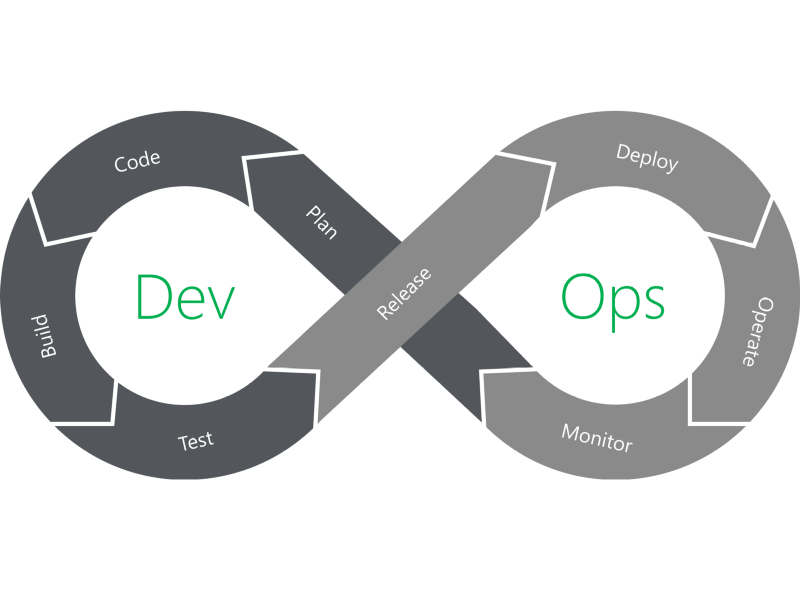

In my last article, I covered the basics of DevOps and highlighted the benefits that have motivated so many organisations to shift for this new model for software development. This article will build on the last, so if you haven’t already, go check it out 👇

[**Part 1: What is DevOps?**](../what-is-devops)

---

When talking about DevOps, it’s useful to divide the process into phases which come together to make a DevOps pipeline. This way, we can break down the problem of describing the tools and processes used throughout the various phases.

Different people will apply their scalpel to cut the pipeline in different places and come up with a different list of phases, but the result usually describes the same process. The important thing is to be consistent with terminology within your organisation so everybody is on the same page.

> It’s worth noting that, while it’s useful to break the DevOps pipeline into phases to make it easier to discuss, in practice it is a continuous workflow followed by the same team or blend of teams, depending on the organisational structure. There are no hard barriers between each of the phases of the pipeline.

This article will describe the eight-phase DevOps pipeline we use at Taptu and define some other terms commonly used when talking about DevOps.

## Plan

The Plan stage covers everything that happens before the developers start writing code, and it’s where a Product Manager or Project Manager earns their keep. Requirements and feedback are gathered from stakeholders and customers and used to build a product roadmap to guide future development. The product roadmap can be recorded and tracked using a ticket management system such as Jira, Azure DevOps or Asana which provide a variety of tools that help track project progress, issues and milestones.

The product roadmap can be broken down into Epics, Features and User Stories, creating a backlog of tasks that lead directly to the customers’ requirements. The tasks on the backlog can then be used to plan sprints and allocate tasks to the team to begin development.

## Code

Once the team had grabbed their coffees and had the morning stand-up, the developments can get to work. In addition to the standard toolkit of a software developer, the team has a standard set of plugins installed in their development environments to aid the development process, help enforce consistent code-styling and avoid common security flaws and code anti-patterns.

This helps to teach developers good coding practice while aiding collaboration by providing some consistency to the codebase. These tools also help resolve issues that may fail tests later in the pipeline, resulting in fewer failed builds.

## Build

The Build phase is where DevOps really kicks in. Once a developer has finished a task, they commit their code to a shared code repository. There are many ways this can be done, but typically the developer submits a pull request — a request to merge their new code with the shared codebase. Another developer then reviews the changes they’ve made, and once they’re happy there are no issues, they approve the pull-request. This manual review is supposed to be quick and lightweight, but it’s effective at identifying issues early.

Simultaneously, the pull request triggers an automated process which builds the codebase and runs a series of end-to-end, integration and unit tests to identify any regressions. If the build fails, or any of the tests fail, the pull-request fails and the developer is notified to resolve the issue. By continuously checking code changes into a shared repository and running builds and tests, we can minimise integration issues that arise when working on a shared codebase, and highlight breaking bugs early in the development lifecycle.

## Test

Once a build succeeds, it is automatically deployed to a staging environment for deeper, out-of-band testing. The staging environment may be an existing hosting service, or it could be a new environment provisioned as part of the deployment process. This practice of automatically provisioning a new environment at the time of deployment is referred to as Infrastructure-as-Code (IaC) and is a core part of many DevOps pipelines. More on that in a later article.

Once the application is deployed to the test environment, a series of manual and automated tests are performed. Manual testing can be traditional User Acceptance Testing (UAT) where people use the application as the customer would to highlight any issues or refinements that should be addressed before deploying into production.

At the same time, automated tests might run security scanning against the application, check for changes to the infrastructure and compliance with hardening best-practices, test the performance of the application or run load testing. The testing that is performed during this phase is up to the organisation and what is relevant to the application, but this stage can be considered a test-bed that lets you plug in new testing without interrupting the flow of developers or impacting the production environment.

## Release

The Release phase is a milestone in a DevOps pipeline — it’s the point at which we say a build is ready for deployment into the production environment. By this stage, each code change has passed a series of manual and automated tests, and the operations team can be confident that breaking issues and regressions are unlikely.

Depending on the DevOps maturity of an organisation, they may choose to automatically deploy any build that makes it to this stage of the pipeline. Developers can use feature flags to turn off new features so they can’t be seen by the customers until they are ready for action. This model is considered the nirvana of DevOps and is how organisations manage to deploy multiple releases of their products every day.

Alternatively, an organisation may want to have control over when builds are released to production. They may want to have a regular release schedule or only release new features once a milestone is met. You can add a manual approval process at the release stage which only allows certain people within an organisation to authorise a release into production.

The tooling lets you customise this, it’s up to you how you want to go about things.

## Deploy

Finally, a build is ready for the big time and it is released into production. There are several tools and processes that can automate the release process to make releases reliable with no outage window.

The same Infrastructure-as-Code that built the test environment can be configured to build the production environment. We already know that the test environment was built successfully, so we can rest assured that the production release will go off without a hitch.

A blue-green deployment lets us switch to the new production environment with no outage. Then the new environment is built, it sits alongside the existing production environment. When the new environment is ready, the hosting service points all new requests to the new environment. If at any point, an issue is found with the new build, you can simply tell the hosting service to point requests back to the old environment while you come up with a fix.

## Operate

The new release is now live and being used by the customers. Geat work!

The operations team is now hard at work, making sure that everything is running smoothly. Based on the configuration of the hosting service, the environment automatically scales with load to handle peaks and troughs in the number of active users.

The organisation has also built a way for their customers to provide feedback on their service, as well as tooling that helps collect and triage this feedback to help shape the future development of the product. This feedback loop is important — nobody knows what they want more than the customer, and the customer is the world’s best testing team, donating many more hours to testing the application than the DevOps pipeline ever could. You need to capture this information, it’s worth its weight in gold.

## Monitor

The ‘final’ phase of the DevOps cycle is to monitor the environment. this builds on the customer feedback provided in the Operate phase by collecting data and providing analytics on customer behaviour, performance, errors and more.

We can also do some introspection and monitor the DevOps pipeline itself, monitoring for potential bottlenecks in the pipeline which are causing frustration or impacting the productivity of the development and operations teams.

All of this information is then fed back to the Product Manager and the development team to close the loop on the process. It would be easy to say this is where the loop starts again, but the reality is that this process is continuous. There is no start or end, just the continuous evolution of a product throughout its lifespan, which only ends when people move on or don’t need it any more.

# Continuous Everything

Alongside the phases of the DevOps pipeline, you’ll commonly hear people talking about Continous Everything — Continuous Integration, Continuous Delivery, Continuous Deployment and more. This is because continuity is at the core of DevOps, and we tech people love our terminology and buzzwords. However, they do serve a purpose. Let’s break down each of these terms and how they relate to the phases of the pipeline.

## Continuous Integration

One of the biggest difficulties in coordinating a software development team is managing the collaboration of many developers, often in remote locations, on a single codebase. A shared code repository is key to solving this problem, however, there can still be issues in when merging the changes made by multiple people on the same piece of code.

A change made by one developer may impact what somebody else is working on, and the longer that developers wait to integrate their changes back into the shared codebase, the bigger the drift, resulting in more effort and headache in resolving the issues and conflicts.

Continuous integration aligns with the Code and Build phases of the DevOps pipeline. It’s the practice of regularly merging a developer’s code into the centralised codebase and conducting automated testing to ensure that no regressions have been introduced. By merging smaller changes more regularly, these issues become smaller and easier to manage, improving overall productivity and sanity.

## Continuous Delivery

Continuous Delivery is an extension of Continuous Integration which automates the process of deploying a new build into production. The goals of Continuous Delivery is to:

1.  Perform automated testing on each new build to verify builds that are ready for release into production, and fail those which are not.
2.  Manage the automatic provisioning and configuration of deployment environments, as well as testing of these environments for stability, performance and security compliance.
3.  Deploy a new release into production when approved and manually triggered by the organisation.

Continuous Delivery aligns with the Test and Release phases of the pipeline, and allows organisations to manually trigger the release of new builds as regularly as they choose.

## Continuous Deployment

Continuous Deployment is a more advanced version of Continous Delivery (which makes the reuse of the ‘CD’ abbreviation more acceptable). The goals are the same, but the manual step of approving new releases into production is removed. In a Continuous Deployment model, each build which passes all of the checks and balances of the pipeline are automatically deployed into production.

## Continuous Feedback

CI and CD tend to get the glory when people talk about DevOps, but an equally important factor is Continuous Feedback. The whole point of DevOps is to release new features and fixes as quickly as possible so that the organisation can get feedback from customers, stakeholders and analytics as quickly as possible to make better decisions when designing the next set of changes. The whole point is to achieve a strong Continous Feedback loop to develop a better product.

It’s Continuous Feedback that ties the ends of the loop together, feeding back data and analytics from the Operate and Monitor phases back into the Plan phase to do it all over again.

---

**Thanks for reading!**  
If you enjoyed this post, follow on [Twitter](https://www.twitter.com/@JakobTheDev) or [Mastodon](https://infosec.exchange/@JakobTheDev) for more content. If you have any feedback or suggestions, leave it in the comments below and I'll do my best to get back to you.
