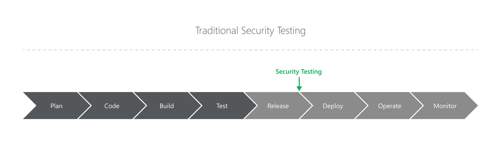
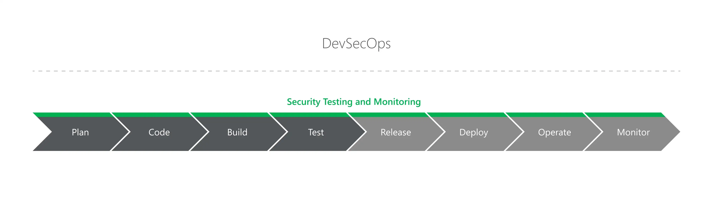

So far in the Introduction to DevOps series, we’ve covered what DevOps is at a high-level and what the practice aims to achieve. We then broke down the DevOps pipeline into phases to get a better understanding of how a DevOps pipeline hangs together as well as some common terminology. If you haven’t already go check them out first 👇

[**Part 1: What is DevOps?**](../what-is-devops)

[**Part 2: The Eight Phases of a DevOps Pipeline**](../eight-phases-devops-pipeline)

---

## The Problem with Traditional Security Testing

In a traditional software development lifecycle, the majority of an application’s security testing typically happens towards the end of the development process. When an application is nearing deployment to the production environment, a code review or penetration test may be conducted to find security flaws in the application.

It’s important to get a third-party security expert to review and test the application to provide some assurance that there aren’t any vulnerabilities which may lead to a breach or other security incident. Any flaws identified during the test are addressed, and the application is deployed.

The issue is not with the security testers; penetration testing and code reviews are an important part of an application security program. The problem is that this is way too late to start security testing.

Too often I have found major security vulnerabilities during a penetration test just as (or, worse, just after) the client is looking to deploy the application into production. It makes sense, the application is complete and they want to meet their deadlines and deliver the product to their customers as soon as possible. Going live is an exciting time!

But when you find issues, the client has to decide whether they delay a launch, apply a hotfix (which may or may not solve the problem) or go live with the plan to fix shortly after. None of these options is a good outcome. The only good that comes of this is the fact that the issues were identified and can be patched.

Building on this is that you are putting all of your security eggs into the security expert’s basket. You may have a good relationship with a security firm who has done good work in the past, but the reality is that organisation has its fate cast by the skill of the security expert doing the testing. More important than this, even a skilled penetration tester is unable to test for every scenario in a complex application. Things will inevitably be missed and make it into the production environment.

This is where defence-in-depth comes into play. We put layers of controls in place so if one fails, the damage is contained or mitigated entirely. Similarly, we should do security-testing-in-depth, ensuring that each line of code has passed a series of security tests before it reaches the production environment.

## But what about secure software development?

The issue with the traditional security testing model is that there may be little or no testing conducted throughout the development process to identify security flaws. We rely on the skills of the software development team to avoid common vulnerabilities from being introduced into the application.

It’s easy to say that its the job of a software developer to understand the security implications of the code they are writing, and to point the blame at developers for introducing security flaws at the application layer. While there is some truth to this, software developers do need to understand basic security concepts, it is unreasonable to expect every software developer to be a security expert.

A good software developer needs a breadth of skills and knowledge to do their job. Writing code that meets the functionality requirements of a complex application is challenging on its own. In addition to this, a developer needs to consider user experience, performance, accessibility, multiple tools and languages, code readability, good development patterns, time management, team management, and many other things _in addition_ to security. Add in pressure to meet tight deadlines and it’s clear that it is difficult to be a good software developer.

> It is unreasonable to expect software developers to also be security experts and to not make mistakes.

## Shifting Left with DevSecOps

The philosophy behind DevSecOps is to begin security testing earlier in the software development lifecycle. Rather than putting a heavy reliance on security testing when the application is released into production, we shift testing to the left by baking security planning, testing and monitoring into each phase of the DevOps pipeline.

Importantly, DevSecOps does not replace traditional security testing or secure software development practices — it merely complements them. Security testing prior to production release is still important, but now it’s a final check after a program of thorough security testing. Similarly, understanding application security is still an important skill of a good software developer, but they now have the tools that they need to help them write secure code.

The benefit of this approach is that we can assure that every change to the codebase has had a series of security tests applied before it is accepted into a build that is ready to be released into production. If at any point a security test fails, an organisation may choose to fail the build and notify the developer immediately, or if the flaw is of low severity, feed the issue back into the ticket management system for prioritisation by the agile lead.

In addition to providing additional layers of testing, by identifying security flaws earlier in the development lifecycle, the effort and cost resolving the issue are significantly reduced. A developer may be notified within minutes of a potential flaw introduced in their last pull-request and can begin to address it while it is fresh in their mind. This is in contrast to finding the flaw weeks or months later during a penetration test, in which time the issue may have compounded and become much more difficult to resolve.

The best part is, in following a DevOps methodology for software development, we already have an automated pipeline of tooling and practices which build, test and release our applications. All we need to do is use set up additional tooling to automate security testing.

---

**Thanks for reading!**  
If you enjoyed this post, follow on [Twitter](https://www.twitter.com/@JakobTheDev) or [Mastodon](https://infosec.exchange/@JakobTheDev) for more content. If you have any feedback or suggestions, leave it in the comments below and I'll do my best to get back to you.
